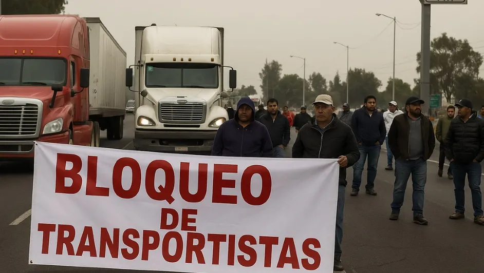

PROYECTO BEL
<!DOCTYPE html>
<html lang="es">

<head>
    <meta charset="UTF-8" />
    <meta name="viewport" content="width=device-width, initial-scale=1.0" />
    <title>Megabloqueo de Transportistas - Problemática</title>
    <link rel="stylesheet" href="styles.css" />
</head>

<body>
    <header>
        <h1>Megabloqueo de Transportistas en México</h1>
    </header>

    <section class="problema">
        <h2>¿Cuál es el problema?</h2>
        

            En noviembre de 2025, cientos de transportistas en México convocados por organizaciones como
            ANTAC, FNRCM y MAC realizaron un paro nacional: un “megabloqueo” de carreteras y aduanas.
            La razón principal: denuncian inseguridad constante en las vías de transporte, que incluye extorsiones,
            robos y hasta secuestros.
        

    </section>

    <section class="evidencias">
        <h2>Casos y Evidencias</h2>
        <ul>
            <li>
                Transportistas denuncian que “la corrupción y la extorsión existen por algunos elementos de Guardia
                Nacional, seguridad pública estatal y hasta policías municipales”.
            </li>
            <li>
                Reportes indican que en rutas del país, los robos a unidades de carga han aumentado drásticamente; en
                algunas jornadas esa cifra llegó a hasta 70–80 unidades robadas al día.
            </li>
            <li>
                Los bloqueos afectaron una gran parte de la República: participaron estados como Jalisco (tu estado),
                Estado de México, Nuevo León, Chiapas, Veracruz, entre muchos otros.
            </li>
        </ul>
        

            
            
Bloqueo de transportistas — imagen ilustrativa de la protesta. Fuente: Milenio

        

    </section>

    <section class="solucion">
        <h2>Posible solución</h2>
        

            Una solución viable sería que las autoridades federales y estatales implementen un plan integral de
            seguridad en carreteras, con:
        

        <ul>
            <li>Mejor vigilancia y patrullaje permanente en rutas de carga.</li>
            <li>Canales accesibles y transparentes para reportar amenazas, robos o extorsiones.</li>
            <li>Agilización de trámites burocráticos: placas, licencias, permisos, sin trabas que vulneren a los
                transportistas.</li>
            <li>Incentivos o apoyos al transporte y al campo, para reconocer su rol clave en la economía nacional.
            </li>
        </ul>
    </section>

    <section class="comentarios">
        <h2>Comentarios</h2>
        <form action="#" method="post">
            <label for="nombre">Nombre (opcional):</label> 
            <input type="text" id="nombre" name="nombre" />  
            <label for="comentario">Tu comentario:</label> 
            <textarea id="comentario" name="comentario" rows="4" cols="50"></textarea>  
            <button type="submit">Enviar comentario</button>
        </form>
    </section>

    <footer>
        
Fuente de información: artículo sobre el megabloqueo de transportistas en Milenio. 2025.

    </footer>
</body>

</html>
